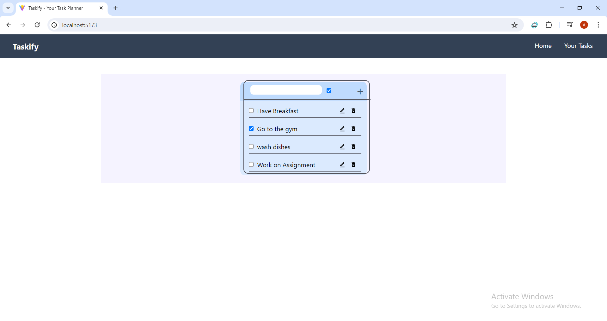
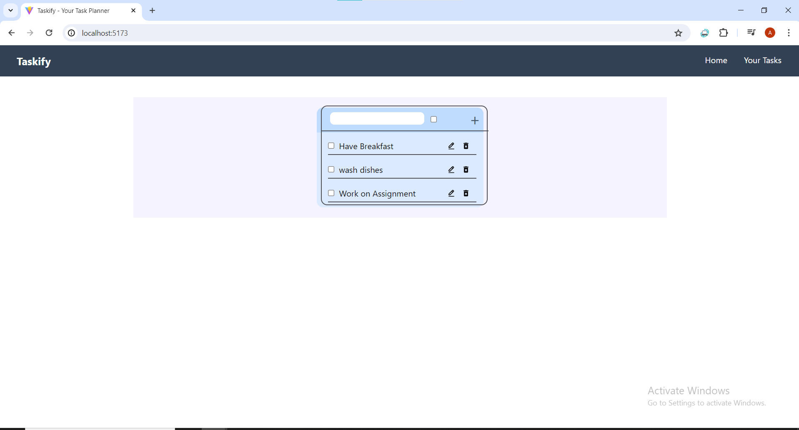

# React + Vite

# To-Do List Application

## Overview

This To-Do List application is designed to help users manage their tasks efficiently. It offers features such as task addition, deletion, editing, and a checkbox to filter between finished tasks and tasks that are yet to be done. The application is built using React and styled with Tailwind CSS for a modern and responsive user interface.

## Features

- **Add Task**: Easily add new tasks to your to-do list.
- **Delete Task**: Remove tasks that are no longer needed.
- **Edit Task**: Modify task details as required.
- **Checkbox**: Toggle between viewing finished tasks or tasks that need to be done.

## Technologies Used

- React: Frontend development framework.
- Tailwind CSS: Used for styling and layout.
- Vite: Build tool for fast development and optimized builds.
- LocalStorage: Utilized to retain memory of tasks even after closing the browser.

## Responsive Design

The height of the to-do list dynamically adjusts to accommodate more tasks as they are added or removed, ensuring a seamless user experience across different screen sizes.

## Directory Structure

to-do-list
│
└───todoList
│
└───src
│
└───assets
│ todolist.png
│ todolist2.png

## Getting Started

1. Clone this repository.
2. Navigate to the `todoList` directory.
3. Run 'npm run dev'
